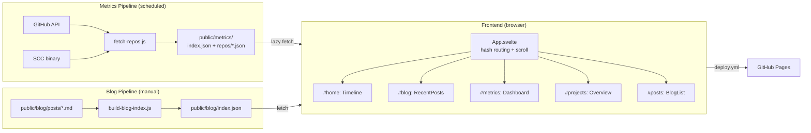

# Architecture

Svelte 4 + Vite 5 static portfolio site deployed to GitHub Pages.



## Tech Stack

| Layer | Technology |
|-------|-----------|
| Framework | Svelte 4.2 |
| Bundler | Vite 5.4 |
| Charts | Hand-crafted SVG (spider/radar) |
| Markdown | marked + DOMPurify |
| Tests | Vitest + @testing-library/svelte |
| CI/CD | GitHub Actions (metrics scan) |
| Hosting | Vercel (migrating from GitHub Pages) |

## Directory Layout

```
src/
  App.svelte                    # Root: routing, scroll sync, section layout
  main.js                       # Entry point
  stores/
    portfolioStore.js            # All portfolio state (writable + 12 derived stores)
    theme.js                     # Dark/light mode with localStorage
  utils/
    dataLoader.js                # Fetch, format numbers/currency, language colors
    blogLoader.js                # Fetch blog index/posts, parse frontmatter
    portfolioTransforms.js       # Filter + sort repos (pure functions)
    profileMetrics.js            # Quality signals, baselines, proficiency stats
    spiderTransforms.js          # Language data -> spider chart datasets
    mobileHeaderVisibility.js    # Scroll-based mobile header hide
  components/
    layout/
      PageContainer.svelte       # Root container, viewport height management
      Frame.svelte               # Decorative edge borders
      Masks.svelte               # Top/bottom gradient masks
      SiteHeader.svelte          # Fixed nav rail + identity
      ContentLayer.svelte        # z-index 2 content wrapper
      Copyright.svelte           # Attribution footer
    portfolio/
      OverallCharacterDashboard  # Category + language + quality spiders
      PortfolioOverview          # Searchable repo grid + pagination
      RepoCard                   # Compact repo summary card
      RepoDetailPanel            # Full-screen detail modal
      CategorySpider             # Reusable radar chart (SVG)
    blog/
      RecentPosts                # Top 3 posts (scroll section)
      BlogList                   # Full post list (standalone view)
      BlogPost                   # Single post reader (markdown)
    Timeline.svelte              # Career milestones
    ThemeSwitcher.svelte         # Dark/light toggle

scripts/
  fetch-repos.js                 # 8-stage metrics pipeline orchestrator
  build-blog-index.js            # Generate blog index from markdown
  validate-metrics.js            # Metrics integrity checker
  utils/
    scan-planner.js              # Incremental scan planning (sourceRef)
    project-classifier.js        # Auto-classify repos into categories
    cocomo.js                    # COCOMO cost/effort estimates
    anonymize.js                 # Private repo sanitization

public/
  metrics/index.json             # Portfolio totals + repo summaries
  metrics/repos/{id}.json        # Per-repo detail files
  blog/index.json                # Blog post index (pre-generated)
  blog/posts/*.md                # Blog posts with YAML frontmatter
```

## Routing

| Hash | View | Component |
|------|------|-----------|
| `#home` | scroll section | Timeline |
| `#blog` | scroll section | RecentPosts |
| `#metrics` | scroll section | OverallCharacterDashboard |
| `#projects` | scroll section | PortfolioOverview |
| `#contact` | scroll section | inline |
| `#privacy` | scroll section | inline |
| `#posts` | standalone | BlogList |
| `#posts/{slug}` | standalone | BlogPost |

## Data Loading

Portfolio data is **lazy-loaded** via IntersectionObserver when the metrics or projects sections approach the viewport (500px margin). Blog index is fetched on mount of RecentPosts/BlogList with in-memory caching.

## Detailed Diagrams

See [`.system-design-visualization.md`](.system-design-visualization.md) (local only, not committed) for Mermaid diagrams covering component hierarchy, store architecture, metrics pipeline stages, blog data flow, routing system, and CI/CD workflows.
